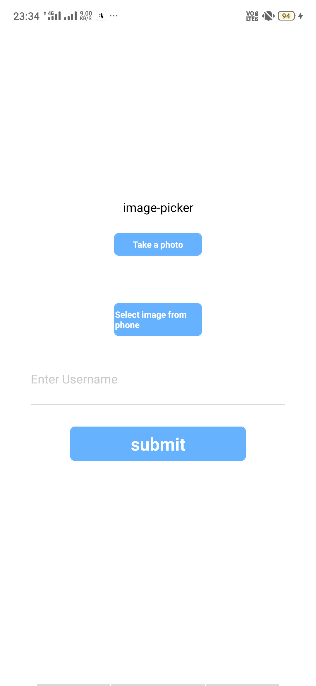
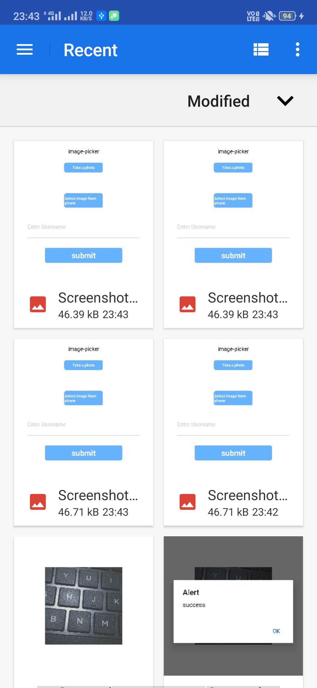
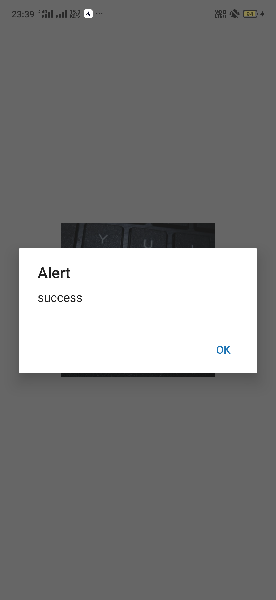
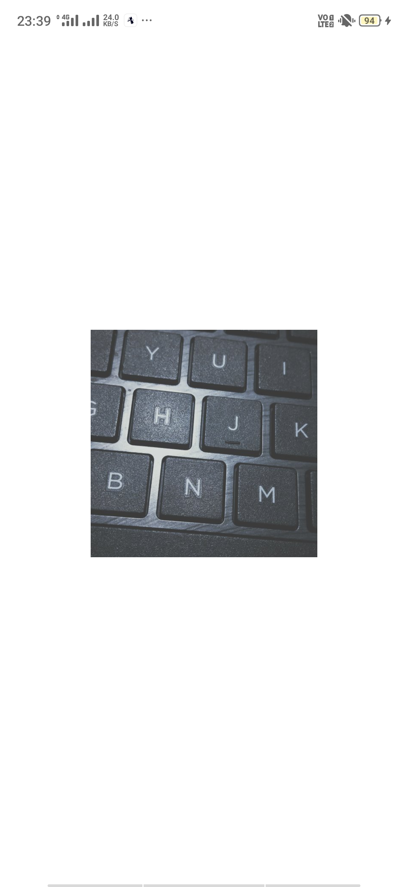

# uploading-image-to-firestore-in-reactnative
creating a react-native app to capture photos or selecting from mobile and uploading and retreiving data from cloud firestore

  1.CREATE A APP USING EXPO-CLI
  
     expo init react-image-picker
   ->this creates a all default project folders
   
  2.INSTALLING REACT-NATIVE-IMAGE-PICKER OR EXPO-IMAGE-PICKER
     
   FOR REACT-NATIVE-CLI
           
        npm install --save react-native-image-picker
   FOR EXPO-CLI
    
        expo install expo-image-picker
        
  3.ADDING REACT-NAVIGATION TO OUR PROJECT AND CREATING TWO SCREENS
  
       expo install react-navigation
     
   ->this adds navigation between screens
    
       screens/imageupload.js
       
   ->this is the starting page of our app which contains two buttons to select a image from library or capturing a photo from camera....and it uploads the      image uri into firebase.Basically in mobile-development platform captured image will be considered as object containing different attributes as shown      below in console log
   
   
     
     screens/imageshow.js
     
   ->this screen retreives the image from firestore by using the uri that we send from imageupload screen.We can see the uri and username are uploaded successfully to cloud firestore
  
   
   
  4.RUN THE APP IN EXPO CLIENT
  
   ->Enter the project and then..
    
       react-image-picker/npm start
       
   ->lets see the amazing app 
   
       screens/imageupload
       
   
     
       launching camera and capturing photo
       
   
   
       selecting image from gallery
       
   
       
       alert (suceess or not)
       
   
   
        screens/imageshow
 
   
